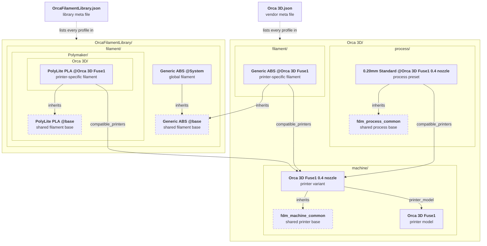

# Guide: Develop Profiles for OrcaSlicer

This guide explains OrcaSlicer's profile system and how to create or maintain its shipped printer, filament and process profiles in a source checkout.

- [High-level Overview](#high-level-overview)
- [File Structure and Templates](#file-structure-and-templates)
- [Naming Conventions](#naming-conventions)
- [Create or Update a Profile Bundle](#create-or-update-a-profile-bundle)
- [Vendor Meta File](#vendor-meta-file)
- [Printer Model Profiles](#printer-model-profiles)
- [Printer Variant Profiles](#printer-variant-profiles)
- [Process Profiles](#process-profiles)
- [Filament Profiles](#filament-profiles)
    - [Adding Filament Profiles to the Global Library](#adding-filament-profiles-to-the-global-library)
    - [Adding a Filament Brand](#adding-a-filament-brand)
    - [Adding Filament Profiles to Printer Vendor Library](#adding-filament-profiles-to-printer-vendor-library)
- [Setting IDs](#setting-ids)
- [Filament IDs](#filament-ids)
- [Testing Profile Changes](#testing-profile-changes)
- [Validate Profiles](#validate-profiles)

## High-level Overview

### Three Presets Describe a Print

A **profile**, also called a **preset**, is a named collection of settings stored in a JSON file. Preparing a print brings together three kinds of preset:

| Preset | The question it answers | Typical settings |
| --- | --- | --- |
| Printer (`machine`) | What hardware am I printing on? | Bed size, nozzle diameter, motion limits and machine G-code |
| Filament (`filament`) | What material am I printing with? | Temperatures, cooling, flow ratio and maximum volumetric speed |
| Process (`process`) | How should the part be printed? | Layer height, walls, infill, supports and print speeds |

For example, a user might select `Orca 3D Fuse1 0.4 nozzle`, `Generic PLA @System` and `0.20mm Standard @Orca 3D Fuse1 0.4 nozzle`. Changing the layer height belongs in the process profile; changing the material's temperature belongs in the filament profile. These settings are kept separate so the same printer can use many materials and quality levels.

### Models, Variants and Bundles

A **printer model** (`machine_model`) describes a product, such as `Orca 3D Fuse1`. It lists the available nozzle variants and references the bed model and texture used in the 3D view. A **printer variant** (`machine`) is the actual printer preset used for slicing, such as `Orca 3D Fuse1 0.4 nozzle`. One model can have several variants.

A **vendor bundle** groups related profiles. It consists of a folder containing the profiles and a matching JSON **meta file** that lists them. Think of the meta file as the bundle's index: putting a new file in the folder is only half the job; you must also register it in that index.

`OrcaFilamentLibrary` is a shared bundle of generic and branded filament profiles. Printer bundles can use these materials and inherit their settings. You only need a printer-specific filament profile when you have material settings tuned for that printer.

### Inheritance Reuses Settings

The `inherits` field names a parent profile. OrcaSlicer first resolves the parent's settings, then applies the child's values on top. Any setting omitted by the child keeps its inherited value. Parents can also inherit from other profiles.

A **shared base** holds settings for other profiles and is not selectable in the UI (`"instantiation": "false"`). A **selectable preset** supplies a configuration users can choose (`"instantiation": "true"`). Both can be parents of other profiles.

For example, several process profiles can inherit `fdm_process_common`. The common base holds shared settings, while each child supplies its own layer height and quality adjustments. Changing the common base affects every child that has not overridden that setting.

Printer and process profiles inherit within their vendor bundle. Filament profiles can also inherit from `OrcaFilamentLibrary`.

### Compatibility Chooses Where a Preset Is Available

Inheritance and compatibility answer different questions: `inherits` says where settings come from; `compatible_printers` lists the printer variants where a filament or process preset can be used.

A global filament can serve many printers. When a printer-specific filament has the same **alias** as a global filament, OrcaSlicer uses the printer-specific one on its listed printers. The alias normally comes from the part of the name before `@`: `Generic PLA @Orca 3D Fuse1` replaces `Generic PLA @System` on the supported Fuse1 variants. Other printers keep using the global profile.

### How the Files Connect

The diagram below uses the example `Orca 3D` bundle from this guide. Each box is one JSON file, labeled with its profile name. The shaded areas are folders, nested as they are on disk, and each bundle's meta file lists every profile inside its folder. Solid arrows are references through the named field, and dashed boxes are shared bases that users never select.



A printer-specific filament can live in either bundle. `Generic ABS @Orca 3D Fuse1` is the printer vendor's own tune, so it lives in the vendor bundle. `PolyLite PLA @Orca 3D Fuse1` is a filament brand's tune for the same printer, so it lives in the brand's folder in the library. Each inherits its product's shared base, `Generic ABS @base` or `PolyLite PLA @base`, the same base its global preset inherits. Both list the Fuse1 variant in `compatible_printers`, and on that printer each replaces the global preset with the same alias, `Generic ABS @System` and `PolyLite PLA @System`. This replacement comes from the shared alias and the compatibility list, not from inheritance: neither tune inherits the global preset it replaces.

### Two IDs Serve Different Purposes

| ID | What it identifies | Example |
| --- | --- | --- |
| `setting_id` | One selectable preset | Two printer-specific presets of PolyLite PLA have different setting IDs |
| `filament_id` | One filament product, shared across its presets | Those PolyLite PLA presets share one filament ID |

The ID tool generates both values; see [Setting IDs](#setting-ids) and [Filament IDs](#filament-ids) for details.

## File Structure and Templates

Edit `resources/profiles/` in your **OrcaSlicer source checkout**. This is the source of the profiles distributed with the application. The examples use a fictional vendor, `Orca 3D`, and its `Fuse1` printer, starting with a 0.4 mm nozzle.

```text
resources/profiles/
├── Orca 3D.json                          # Vendor meta file (the index)
├── Orca 3D/
│   ├── machine/
│   │   ├── fdm_machine_common.json       # Shared printer settings
│   │   ├── Orca 3D Fuse1.json            # Printer model
│   │   └── Orca 3D Fuse1 0.4 nozzle.json # Selectable printer variant
│   ├── process/
│   │   ├── fdm_process_common.json       # Shared process settings
│   │   └── 0.20mm Standard @Orca 3D Fuse1 0.4 nozzle.json
│   └── filament/                         # Optional vendor filament tuning
│       └── Generic ABS @Orca 3D Fuse1.json
├── OrcaFilamentLibrary.json              # Shared filament index
└── OrcaFilamentLibrary/
    └── filament/
        ├── Generic ABS @base.json        # Shared product settings
        ├── Generic ABS @System.json      # Generic material for all printers
        └── Polymaker/                    # Filament brand
            ├── PolyLite PLA @base.json   # Shared product settings
            ├── PolyLite PLA @System.json # Brand's filament for all printers
            └── Orca 3D/                  # Optional brand tuning for Orca 3D printers
                └── PolyLite PLA @Orca 3D Fuse1.json
```

Each profile's filename is its `name` plus `.json`. Use the same name in the vendor meta file and in references from other profiles. Choose names by following the [Naming Conventions](#naming-conventions).

Templates are in `resources/profiles_template/Template/`. Existing bundles are also useful examples, especially for printer hardware similar to yours. When adapting one, review its firmware, dimensions, motion limits and G-code instead of assuming that all settings transfer to your printer.

> [!TIP]
> Use a short vendor name to keep filenames manageable. The paths in this guide use `/`; use the equivalent path separator for your operating system.

### Common Profile Fields

Printer, filament and process JSON files use these fields. A `machine_model` is a separate metadata record.

| Field | Value |
| --- | --- |
| `inherits` | The parent's exact `name`, without `.json` or a directory path |
| `instantiation` | `"false"` for a shared base; `"true"` for a selectable preset |
| `from` | `"system"` for profiles distributed with OrcaSlicer |
| `compatible_printers` | Filament and process only: an array of full printer variant names, such as `["Orca 3D Fuse1 0.4 nozzle"]` |

Write JSON field names in quotes and preserve the value types used by the templates, including the strings `"true"` and `"false"`. A folder name or a suffix such as `@System` or `@base` does not create inheritance; use `inherits` to name the parent.

Set compatibility explicitly on selectable filament and process profiles. Use printer variant names, not model names or filenames. Printer vendor filaments require a non-empty list; the global library can use an empty list, subject to compatibility conditions and replacement by a printer-specific preset.

## Naming Conventions

Users pick presets by name, and other profiles refer to them by name. Name new profiles by these conventions so users can tell at a glance which printer and nozzle a preset is for. A name only describes a profile; `inherits` and `compatible_printers` still decide what it inherits and where it is available.

### Selectable Presets

| Profile | Name pattern | Example |
| --- | --- | --- |
| Printer model | `<brand> <printer>` | `Orca 3D Fuse1` |
| Printer variant | `<brand> <printer> <nozzle> nozzle` | `Orca 3D Fuse1 0.4 nozzle` |
| Process | `<layer height> <quality> @<vendor> <printer code> <nozzle> nozzle` | `0.30mm Standard @Orca 3D Fuse1 0.6 nozzle` |
| Filament | `<filament name> @<vendor> <printer code>` | `Generic ABS @Orca 3D Fuse1` |
| Global filament | `<filament name> @System` | `Generic PLA-GF @System` |

| Part | Rule | Examples |
| --- | --- | --- |
| `<brand> <printer>` | The printer's full product name | `Orca 3D Fuse1`, `Orca 3D Fuse1 Pro` |
| `<nozzle>` | Nozzle diameter in millimeters | `0.2`, `0.25`, `0.4`, `0.6`, `0.8` |
| `<layer height>` | Layer height with two decimals, followed by `mm`, so presets sort by layer height | `0.08mm`, `0.20mm`, `0.28mm` |
| `<quality>` | A capitalized quality label. Name the printer's default process `Standard` | `Extra Fine`, `Fine`, `Standard`, `Draft`, `Extra Draft` |
| `<vendor>` | The vendor's short name, as used for its folder and meta file | `Orca 3D` |
| `<printer code>` | The printer name without the brand, shortened if it is long. Use the same code in every suffix | `Fuse1`, `Fuse1P` for Fuse1 Pro |
| `<filament name>` | The brand or product line, the material, then the product variant | `Generic PETG HF`, `Generic PLA Silk`, `PolyLite PLA` |

The filament name, the part before `@`, normally becomes the preset's alias and is part of its [filament ID](#filament-ids). Use exactly the same filament name for every preset of a product.

### Nozzle Suffix

A process targets one nozzle size, so its suffix ends with `<nozzle> nozzle`. For the 0.4 mm nozzle the suffix may leave it out; use the same form throughout a bundle.

| Nozzle | Process | Filament |
| --- | --- | --- |
| 0.4 mm | `0.20mm Standard @Orca 3D Fuse1 0.4 nozzle` or `0.20mm Standard @Orca 3D Fuse1` | `Generic ABS @Orca 3D Fuse1` |
| 0.2 mm | `0.10mm Standard @Orca 3D Fuse1 0.2 nozzle` | `Generic ABS @Orca 3D Fuse1 0.2 nozzle` |
| 0.6 mm | `0.30mm Standard @Orca 3D Fuse1 0.6 nozzle` | Can be covered by `Generic ABS @Orca 3D Fuse1` |

A filament tune often suits several nozzles, so a filament suffix without a nozzle can list several nozzle variants in `compatible_printers`. Add a nozzle to a filament name only for a tune specific to that nozzle, most often the 0.2 mm.

### Printers That Share Hardware

When printers share the same hardware, one preset can serve all of them. Its suffix names one of the printers, and `compatible_printers` lists the variants of each. For example, `0.20mm Standard @Orca 3D Fuse1 0.4 nozzle` can also list `Orca 3D Fuse1 Pro 0.4 nozzle`. Extend the list instead of copying the preset under each printer's name.

### Shared Bases

Users never see shared bases, so their names are for maintainers. General bases use lowercase `snake_case` with an `fdm_` prefix, where `<scope>` names what their children share, such as a vendor, firmware or printer line. A filament product's base uses the filament name followed by `@base`.

| Base | Name pattern | Example |
| --- | --- | --- |
| Root of each profile type | `fdm_<type>_common` | `fdm_machine_common`, `fdm_process_common`, `fdm_filament_common` |
| Printer group | `fdm_<scope>_common` | `fdm_klipper_common`, `fdm_orca3d_common` |
| Process group | `fdm_process_<scope>_common` | `fdm_process_klipper_common` |
| Process layer height | `fdm_process_<scope>_<layer height>_nozzle_<nozzle>` | `fdm_process_orca3d_0.20_nozzle_0.4` |
| Material | `fdm_filament_<material>` | `fdm_filament_pla`, `fdm_filament_pet` |
| Filament product | `<filament name> @base` | `PolyLite PLA @base` |

A bundle can chain these bases, with each selectable preset at the end of its chain:

```text
fdm_machine_common → fdm_orca3d_common → Orca 3D Fuse1 0.4 nozzle
fdm_process_common → fdm_process_orca3d_0.20_nozzle_0.4 → 0.20mm Standard @Orca 3D Fuse1 0.4 nozzle
fdm_filament_common → fdm_filament_pla → PolyLite PLA @base → PolyLite PLA @System
```

> [!IMPORTANT]
> Apply these conventions to new profiles. Renaming an existing preset changes its `setting_id`, and for a filament also its `filament_id`; see [Renaming or Correcting a Filament](#renaming-or-correcting-a-filament).

## Create or Update a Profile Bundle

Choose the smallest change that meets your goal:

| Your goal | What to add or update |
| --- | --- |
| Support a new printer | A model, its printer variants, compatible processes and the vendor meta file |
| Add a nozzle size to an existing printer | The model's nozzle list, a printer variant, matching processes and any relevant filament compatibility lists |
| Add a generic material or filament product | Profiles and index entries in `OrcaFilamentLibrary` |
| Tune an existing material for a printer | A printer-specific filament profile in the appropriate library, with explicit compatibility |
| Adjust an existing preset | Its own overrides, or a shared base if the change should apply to all its children |

For a new printer, work through these steps:

1. **Choose the bundle and parents.** Reuse the printer vendor's bundle if it exists. For a new vendor, create its folder and meta file. Identify or create the shared printer and process bases.
2. **Describe the hardware.** Add the printer model, then one printer variant for each supported nozzle configuration. Make the variant's `printer_model` match the model name.
3. **Add a usable process.** Create a process for each variant and list that variant in `compatible_printers`. Set the printer's `default_print_profile` to the process's exact name.
4. **Choose materials.** Start with the global filament library. Add printer-specific profiles only for materials you have tuned, and set the printer's default filament to an available preset.
5. **Register the files.** Add the new profiles, including shared bases, to the matching lists in the [Vendor Meta File](#vendor-meta-file). Review names, paths and references together.
6. **Generate IDs and version the update.** Run the [ID tool](#generating-the-id), update the filament snapshot when filament entries or identities change, and bump the last component of each changed bundle's `version`.
7. **Validate and try the profiles.** Run the [profile checks](#validate-profiles), load the changed resources in OrcaSlicer, inspect a sliced model and test the settings on the target printer. When editing a shared base, test all affected variants.

For a filament-only change, use the relevant [filament example](#filament-profiles), then complete registration, ID generation, versioning and validation. The JSON examples below show structure and selected settings; they are not complete, tested configurations for a real printer. Unless a section explicitly shows generated IDs, the examples omit them so you can run the tool after choosing your own names.

## Vendor Meta File

Each bundle has a `resources/profiles/<vendor>.json` meta file next to its folder. OrcaSlicer reads this file to find the profiles to load. Register every profile, including non-selectable bases, in the appropriate list:

| List | Contains |
| --- | --- |
| `machine_model_list` | Printer models (`machine_model`) |
| `machine_list` | Printer variants and shared printer bases (`machine`) |
| `process_list` | Selectable processes and shared process bases (`process`) |
| `filament_list` | Selectable filaments and shared filament bases (`filament`) |

Each entry's `name` matches the profile's name. Its `sub_path` is relative to the vendor folder, not to `resources/profiles/`. For example, this is `Orca 3D.json` for the files shown above:

```json
{
    "name": "Orca 3D",
    "version": "01.00.00.00",
    "force_update": "0",
    "description": "Orca 3D printer profiles",
    "machine_model_list": [
        {
            "name": "Orca 3D Fuse1",
            "sub_path": "machine/Orca 3D Fuse1.json"
        }
    ],
    "machine_list": [
        {
            "name": "fdm_machine_common",
            "sub_path": "machine/fdm_machine_common.json"
        },
        {
            "name": "Orca 3D Fuse1 0.4 nozzle",
            "sub_path": "machine/Orca 3D Fuse1 0.4 nozzle.json"
        }
    ],
    "process_list": [
        {
            "name": "fdm_process_common",
            "sub_path": "process/fdm_process_common.json"
        },
        {
            "name": "0.20mm Standard @Orca 3D Fuse1 0.4 nozzle",
            "sub_path": "process/0.20mm Standard @Orca 3D Fuse1 0.4 nozzle.json"
        }
    ],
    "filament_list": [
        {
            "name": "Generic ABS @Orca 3D Fuse1",
            "sub_path": "filament/Generic ABS @Orca 3D Fuse1.json"
        }
    ]
}
```

If you use only global filaments, leave `filament_list` empty; do not copy their entries into the printer bundle. Add them to `OrcaFilamentLibrary.json` when contributing to the global library itself.

When updating a bundle, increment the last component of its existing `version`, for example `01.00.00.00` → `01.00.00.01`, so users receive the profile update. Preserve the other bundle metadata unless your change requires updating it.

## Printer Model Profiles

A `machine_model` describes the printer product and its available variants. It lives in `resources/profiles/<vendor>/machine/` and is registered in `machine_model_list`.

```json
{
    "type": "machine_model",
    "name": "Orca 3D Fuse1",
    "nozzle_diameter": "0.4",
    "bed_model": "fuse1_bed.stl",
    "bed_texture": "fuse1_texture.svg",
    "model_id": "Fuse1",
    "family": "Orca 3D",
    "machine_tech": "FFF",
    "default_materials": "Generic PLA @System;Generic PETG @System"
}
```

For several nozzle sizes, use a semicolon-separated string such as `"0.2;0.4;0.6;0.8"` and add matching printer variants. Here, `nozzle_diameter` advertises the available sizes; the variant profile below sets the nozzle actually used for slicing. `default_materials` lists the model's default material choices, also separated by semicolons.

### Models

`bed_model` and `bed_texture` refer to assets relative to the vendor folder. Keep the referenced STL and SVG files in that bundle; use a relative subfolder path if you organize assets in a subfolder such as `model/`. These assets describe the bed's appearance; the printer variant's `printable_area` defines its printable boundary.

The vendor folder can also hold a 240×240 px image named `<machine_model_list.name>_cover.png`, such as `Orca 3D Fuse1_cover.png`, for printer selection in the UI.

## Printer Variant Profiles

A `machine` profile defines a selectable hardware configuration. It lives alongside the model in `resources/profiles/<vendor>/machine/`, but is registered in `machine_list`.

Start from a shared printer base such as `fdm_machine_common`. Put settings shared by your printers in that base and the settings specific to this variant in its own file:

```json
{
    "type": "machine",
    "name": "Orca 3D Fuse1 0.4 nozzle",
    "inherits": "fdm_machine_common",
    "from": "system",
    "instantiation": "true",
    "nozzle_diameter": ["0.4"],
    "printer_model": "Orca 3D Fuse1",
    "printer_variant": "0.4",
    "default_filament_profile": ["Generic PLA @System"],
    "default_print_profile": "0.20mm Standard @Orca 3D Fuse1 0.4 nozzle",
    "printable_area": ["0x0", "235x0", "235x235", "0x235"],
    "nozzle_type": "brass"
}
```

`printer_model` links this preset to the model record. `inherits` links it to its settings base; the model record is not that base.

`printer_variant` must exactly match an entry in the linked model's semicolon-separated `nozzle_diameter` list. The validator also checks that the variant's numeric diameters agree with this machine preset's `nozzle_diameter`. For example, `"0.8HF"` identifies a hardware variant with a 0.8 mm nozzle, while `"0.4+0.6"` describes a variant with two nozzle diameters.

Unlike the model's semicolon-separated nozzle list, a machine preset uses an array such as `["0.4"]`. Preserve the value types used by the existing profiles and templates. The default filament and process names must resolve to presets available for this printer.

## Process Profiles

Process profiles define print quality and behavior. They live in `resources/profiles/<vendor>/process/` and are registered in `process_list`. There are no global process profiles shared across all printer bundles.

A shared base uses `"instantiation": "false"`. A selectable quality preset inherits that base and sets its own values. This example sets a 0.20 mm layer height for the 0.4 mm printer variant:

```json
{
    "type": "process",
    "name": "0.20mm Standard @Orca 3D Fuse1 0.4 nozzle",
    "inherits": "fdm_process_common",
    "from": "system",
    "instantiation": "true",
    "layer_height": "0.2",
    "compatible_printers": ["Orca 3D Fuse1 0.4 nozzle"]
}
```

The name helps users recognize the quality level; it does not set the layer height. The `layer_height` field does that. Additional Fine or Draft profiles can inherit the same base and override their layer height, speeds and other quality settings.

## Filament Profiles

Filament profiles hold material settings and are registered in a bundle's `filament_list`. Choose their location by who maintains the settings and what they apply to:

| Contribution | Location under `resources/profiles/` |
| --- | --- |
| Generic material for all printers | `OrcaFilamentLibrary/filament/` |
| Filament brand's products, including its printer-specific tunes | `OrcaFilamentLibrary/filament/<brand>/` |
| Printer vendor's material tuning for its own printers | `<vendor>/filament/` |

> [!IMPORTANT]
> Create a printer-specific filament profile only if you have tuned the filament for that printer. Otherwise use the global library: improvements to it benefit every printer that uses it.

### Adding Filament Profiles to the Global Library

Generic filaments go in `resources/profiles/OrcaFilamentLibrary/filament`. A brand's filaments go in the brand's own subfolder, see [Adding a Filament Brand](#adding-a-filament-brand). Inherit an existing base type if there is one.

This example adds `Generic PLA-GF @System`:

1. Create `Generic PLA-GF @System.json`. Leave `compatible_printers` empty so it is available for all printers, and leave out `setting_id` and `filament_id`.

    ```json
    {
        "type": "filament",
        "name": "Generic PLA-GF @System",
        "from": "system",
        "instantiation": "true",
        "inherits": "fdm_filament_pla",
        "filament_type": ["PLA-GF"],
        "filament_flow_ratio": ["0.96"],
        "compatible_printers": []
    }
    ```

2. Add this entry to the existing `filament_list` in `resources/profiles/OrcaFilamentLibrary.json`. Keep the other entries:

    ```json
    {
        "name": "Generic PLA-GF @System",
        "sub_path": "filament/Generic PLA-GF @System.json"
    }
    ```

3. Generate the IDs and update the snapshot (see [Generating the ID](#generating-the-id)):

    ```sh
    python3 scripts/orca_id_tool.py --generate
    python3 scripts/orca_id_tool.py --update-snapshot
    ```

    The tool adds both IDs. `Generic` (inherited from the base profile), `PLA-GF` and `Generic PLA-GF` give the ID `OFkuMukj`:

    ```json
    {
        "type": "filament",
        "name": "Generic PLA-GF @System",
        "from": "system",
        "setting_id": "DdFPsBKVwzyATCwK",
        "filament_id": "OFkuMukj",
        "instantiation": "true",
        "inherits": "fdm_filament_pla",
        "filament_type": ["PLA-GF"],
        "filament_flow_ratio": ["0.96"],
        "compatible_printers": []
    }
    ```

4. Bump the version in `OrcaFilamentLibrary.json` and [validate the profiles](#validate-profiles).

### Adding a Filament Brand

A filament brand, such as Polymaker, keeps all of its profiles in its own subfolder of the global library, and never adds profiles to a printer vendor's folder:

```text
resources/profiles/
    └── OrcaFilamentLibrary/
        └── filament/
            └── Polymaker/
                ├── PolyLite PLA @base.json
                ├── PolyLite PLA @System.json
                ├── BBL/
                │   └── PolyLite PLA @BBL P1S 0.4 nozzle.json
                └── Qidi/
                    └── PolyLite PLA @Qidi Q2 0.4 nozzle.json
```

The profile for all printers sits directly in `Polymaker`. A profile tuned for a specific printer goes in a subfolder named after that printer's vendor folder, such as `BBL` or `Qidi`. Register all of them in `OrcaFilamentLibrary.json`, with the subfolders in `sub_path`, e.g. `filament/Polymaker/BBL/PolyLite PLA @BBL P1S 0.4 nozzle.json`.

Start with a non-selectable product base. Set `filament_vendor` to the brand and inherit the closest material base:

```json
{
    "type": "filament",
    "name": "PolyLite PLA @base",
    "from": "system",
    "instantiation": "false",
    "inherits": "fdm_filament_pla",
    "filament_vendor": ["Polymaker"]
}
```

Then add the selectable profile for all printers. Inherit the product base and leave `compatible_printers` empty:

```json
{
    "type": "filament",
    "name": "PolyLite PLA @System",
    "from": "system",
    "instantiation": "true",
    "inherits": "PolyLite PLA @base",
    "compatible_printers": []
}
```

Add a printer-specific profile only if you have tuned the filament for that printer. Keep the `PolyLite PLA` name, inherit `PolyLite PLA @base`, and list the printer variants in `compatible_printers`:

```json
{
    "type": "filament",
    "name": "PolyLite PLA @BBL P1S 0.4 nozzle",
    "from": "system",
    "instantiation": "true",
    "inherits": "PolyLite PLA @base",
    "filament_max_volumetric_speed": ["18"],
    "compatible_printers": [
        "Bambu Lab P1S 0.4 nozzle"
    ]
}
```

On that printer, this profile replaces `PolyLite PLA @System`. Both are the filament `PolyLite PLA`, so this profile inherits the same `filament_id`, `OF5CgdDq`.

Register the base and all selectable profiles in `OrcaFilamentLibrary.json`, including any additional printer-specific profiles such as the Qidi example in the tree. Bump the library version, then [generate the IDs and validate](#generating-the-id). Run the full check: a single-vendor run fails on these profiles, see [Checking One Vendor](#checking-one-vendor).

### Adding Filament Profiles to Printer Vendor Library

Printer vendors manage their own vendor folder, including its filament profiles in `resources/profiles/<vendor>/filament`. Filament brands don't add profiles here, see [Adding a Filament Brand](#adding-a-filament-brand). Inherit a library base type if there is one, and set a non-empty `compatible_printers`.

This example tunes `Generic ABS` for `Orca 3D Fuse1`. Only the changed material settings and the intended printer need to be listed:

```json
{
    "type": "filament",
    "name": "Generic ABS @Orca 3D Fuse1",
    "from": "system",
    "instantiation": "true",
    "inherits": "Generic ABS @base",
    "filament_flow_ratio": ["0.98"],
    "filament_max_volumetric_speed": ["12"],
    "compatible_printers": ["Orca 3D Fuse1 0.4 nozzle"]
}
```

These values illustrate an override; use values measured for your printer. Add other nozzle variants to `compatible_printers` only when the tuning applies to them too.

The profile keeps the `Generic ABS` name and inherits `Generic ABS @base`, so it can inherit the library's `filament_id`. It still needs its own generated `setting_id`. A vendor's own branded filament has a different product identity and needs its own filament ID; see [Filament IDs](#filament-ids).

Register the file in the printer vendor's `filament_list`, bump that bundle's version, then [generate the IDs, update the snapshot and validate](#generating-the-id).

## Setting IDs

Every selectable machine, filament or process preset (`"instantiation": "true"`) needs a `setting_id` that is unique across all OrcaSlicer profiles. It is computed from the vendor folder, the profile type (`filament`, `process` or `machine`) and the profile name:

```text
setting_id = base62_16( uuid5(namespace, "<vendor>/<type>/<name>") )
```

Don't write or copy a `setting_id`. Add your profiles without one and let the ID tool fill it in:

```sh
python3 scripts/orca_id_tool.py --generate
```

This works the same for new and existing vendors. The same run adds the [`filament_id`](#filament-ids) of new filaments, and re-running it on an unchanged tree changes nothing. Add `--vendor <Vendor>` to limit it to one vendor, `--setting-id` to write only `setting_id`, or `--dry-run` to preview.

> [!IMPORTANT]
> - Base profiles (`"instantiation": "false"`) must **not** have a `setting_id`.
> - Renaming a preset changes its `setting_id`. Run the tool again after a rename.
> - The IDs in this guide's examples are illustrative. The [profile checks](#validate-profiles) fail on a missing or wrong ID, so always run the tool.

> [!NOTE]
> Bambu Lab (`BBL`) presets are the one exception: they keep their `G*` setting IDs from Bambu Studio. This covers `setting_id` only.

## Filament IDs

`filament_id` identifies a filament product, such as `PolyLite PLA` or `Generic PETG HF`. All printer and nozzle variants of that product share one ID, in every vendor bundle. Printers with a filament system (Bambu Lab AMS, Creality CFS, the Qidi box, Klipper, Snapmaker) use it to match the spool in a slot to a filament preset.

### How the ID Is Generated

The ID is a hash of three values, resolved through the `inherits` chain:

1. `filament_vendor`: the filament manufacturer (e.g. `Polymaker`), or `Generic`. Do not substitute the printer brand just because a preset is tuned for its printer.
2. `filament_type`: the material (e.g. `PLA`).
3. The filament name: the preset name up to the first `@`, with surrounding whitespace removed. `MyBrand PLA @Orca 3D Fuse1` and `MyBrand PLA@HS` are both `MyBrand PLA`.

```text
filament_id = "OF" + base62_6( uuid5(namespace, "filament_product/<filament_vendor>/<filament_type>/<filament_name>") )
```

The result is always 8 characters, short enough for the AMS. The same product gets the same ID everywhere: `Polymaker` / `PLA` / `PolyLite PLA` is always `OF5CgdDq`.

> [!NOTE]
> Bambu Lab filaments follow the same rule. For filaments that exist in both OrcaSlicer and Bambu Studio, OrcaSlicer maintains a mapping file between the two sets of IDs.

> [!IMPORTANT]
> Never write or copy a `filament_id`. Create the filament without one and let the ID tool add it.

### Do I Need a New ID?

Only if users would see it as a different spool product.

| Situation | `filament_id` |
| --- | --- |
| Printer or nozzle variant of an existing filament | Same ID |
| Vendor-tuned generic (e.g. `Generic PLA` for your printer) | The library's ID: inherit `Generic PLA @System` and keep the `Generic PLA` name |
| Product lines (PLA, PLA Matte, PLA Silk, PLA HF) | A new ID for each |
| A new color | Same ID |
| Another diameter of the same product (1.75 mm, 2.85 mm) | A new ID; give it a distinct product name |
| High-speed tune for a different printer model | Same ID |
| High-speed preset offered next to the normal one on the same printer | A new ID (it needs its own name) |

Whether a preset sets `filament_id` or inherits it, the ID must match the preset's own vendor, type and name. `inherits` passes on settings, not identity: `Flashforge ABS Basic @FF C5` inherits `Generic ABS @System` but sets its own `filament_vendor`, so it gets its own ID.

> [!WARNING]
> Printer-specific presets with the same `filament_id` must not share a printer in `compatible_printers`. Otherwise spool matching on that printer is ambiguous and the `validate_filament_subtypes` [check](#validate-profiles) fails. The global fallback is allowed because OrcaSlicer hides it on printers covered by a matching printer-specific preset, as described under [Compatibility](#compatibility-chooses-where-a-preset-is-available).

### Generating the ID

Create the filament profile without a `filament_id`, then run:

```sh
python3 scripts/orca_id_tool.py --dry-run          # preview the IDs
python3 scripts/orca_id_tool.py --generate         # write filament_id and setting_id
python3 scripts/orca_id_tool.py --update-snapshot  # update scripts/filament_id_snapshot.json
./scripts/check_profile.sh                         # validate (.\scripts\check_profile.bat on Windows)
```

Commit the profiles together with `scripts/filament_id_snapshot.json`. The snapshot records each filament ID, its product identity and the bundle/filament-name pairs that use it, such as `BBL/PolyLite PLA`. Multiple printer-specific presets of that product in one bundle share a single entry. CI requires the snapshot to match the state derived from the profiles. Don't edit it by hand.

Add `--vendor <Vendor>` to limit `--generate` or `--dry-run` to one vendor, or `--filament-id` to write only `filament_id`. If you skip the tool, CI fails and prints the expected ID.

### Renaming or Correcting a Filament

Renaming a filament or fixing its `filament_vendor` or `filament_type` changes its ID. When renaming, add the old preset name to `renamed_from` so existing projects and user presets still find it. This field is a string:

```json
{
    "renamed_from": "Old Product PLA @System"
}
```

Then run `--generate` and `--update-snapshot` and commit the updated profiles and snapshot.

> [!CAUTION]
> Old IDs are not forwarded. A printer slot or calibration record holding the old ID falls back to matching by filament type until the user selects the filament again. Only change a filament's identity to fix a real mistake.

## Testing Profile Changes

The command-line validator reads your checkout's profile files directly. To inspect the same changes in the GUI, run a build or test installation that contains your edited `resources/profiles/`. Editing the source checkout alone does not update a separately installed copy of OrcaSlicer.

OrcaSlicer also keeps system profiles in its configuration folder. If an older cached copy hides the resources you are testing:

1. In OrcaSlicer, go to **Help** → **Show Configuration Folder**, then close OrcaSlicer.

    

2. Remove the `system` folder from that configuration folder so OrcaSlicer reloads its system profiles.

    

3. Restart OrcaSlicer, enable the printer if needed, and confirm that its variants, default process and compatible filaments appear as expected.
4. Slice a representative model, inspect the preview and generated G-code, and test the settings on the target printer. Automated checks cannot establish print quality or verify the physical machine's limits.

## Validate Profiles

Run the profile checks from the root of your OrcaSlicer checkout. They are the same checks CI runs on every pull request that changes profiles.

macOS and Linux:

```sh
./scripts/check_profile.sh
```

Windows:

```bat
.\scripts\check_profile.bat
```

All checks run even if one fails, and the script exits with an error if any failed.

| Check | Catches |
| --- | --- |
| `extra_json_check` | Duplicate keys, `vendor_name.json` entries that don't match the files, bad filament `compatible_printers`, and [`setting_id`](#setting-ids) or [`filament_id`](#filament-ids) errors |
| `validate_system` | Profiles that fail to load, such as JSON errors, a missing parent profile, or a filament without a `filament_id` |
| `validate_slice` | Custom G-code errors, found by slicing a test cube on every printer |
| `validate_filament_subtypes` | Two filament presets with the same `filament_id` on one printer |
| `validate_custom` | Changes that break user presets made with earlier OrcaSlicer releases |

The script needs Python 3, plus `curl` and `unzip` on macOS and Linux.

### The Profile Validator

The `validate_*` checks need `OrcaSlicer_profile_validator`. The script uses your local build if it finds one in a `build*` folder (Release preferred). Otherwise it downloads the nightly build that CI uses and caches it in `.test/check_profiles/`.

The nightly Linux validator is x86-64 only. On ARM64 Linux, build the validator yourself.

### Options

| `check_profile.sh` | `check_profile.bat` | Description |
| --- | --- | --- |
| `-v`, `--vendor NAME` | `-Vendor NAME` | Check one vendor, named exactly as its `vendor_name.json` (e.g. `"Co Print"`) |
| `-p`, `--profiles DIR` | `-ProfilesDir DIR` | Profile folder for the validator checks (default `resources/profiles`) |
| `--validator BIN` | `-Validator BIN` | Use this validator binary (or set `ORCA_PROFILE_VALIDATOR`) |
| `--download` | `-Download` | Use the nightly validator even if a local build exists |
| `--refresh` | `-Refresh` | Download the validator and fixtures again |
| `--work-dir DIR` | `-WorkDir DIR` | Folder for downloads and logs (default `.test/check_profiles`) |
| `-l`, `--log-level N` | `-LogLevel N` | Validator log level (default `2`) |
| `-h`, `--help` | `-Help` | Show help |

To run only some checks, name them after the options: `./scripts/check_profile.sh validate_system validate_slice`.

> [!TIP]
> On Windows, if you hit the 260-character path limit, set `-WorkDir` to a short folder such as `D:\t`.

### Checking One Vendor

```sh
./scripts/check_profile.sh --vendor "Orca 3D"
```

```bat
.\scripts\check_profile.bat -Vendor "Orca 3D"
```

A vendor run is faster, but CI checks the whole tree:

- `extra_json_check` still checks ids across all vendors, so it can fail on another vendor's files.
- `validate_slice` is skipped for vendors with no printers, such as `OrcaFilamentLibrary`.
- The validator checks fail with `references unknown compatible_printers` when a library profile lists printers of a vendor that isn't being checked, because only that vendor's printers are loaded.

Run the full check before opening a pull request.

### Reading the Results

The run ends with a summary:

```text
==> summary
    PASS  extra_json_check
    PASS  validate_system
    PASS  validate_slice
    PASS  validate_filament_subtypes
    PASS  validate_custom

All checks passed. Logs: /path/to/OrcaSlicer/.test/check_profiles/logs
```

A failed check shows `FAIL` and the path of its log. Logs are saved in `.test/check_profiles/logs/<check>.log`. On failure the script also writes `.test/check_profiles/pr_comment.md`, the same report CI posts on the pull request.

### Running a Check on Its Own

To debug a check outside the script, run its command directly:

```sh
python3 scripts/orca_extra_profile_check.py                    # extra_json_check
python3 scripts/orca_id_tool.py --check                         # filament_id part of extra_json_check
OrcaSlicer_profile_validator -p resources/profiles -l 2         # validate_system
OrcaSlicer_profile_validator -p resources/profiles -s -l 2      # validate_slice
OrcaSlicer_profile_validator -p resources/profiles -l 2 -f      # validate_filament_subtypes
```

Add `--vendor "Orca 3D"` to the Python script, or `-v "Orca 3D"` to the validator, to check one vendor. `orca_extra_profile_check.py` also has two checks CI doesn't run: `--check-materials` and `--check-obsolete-keys`.
